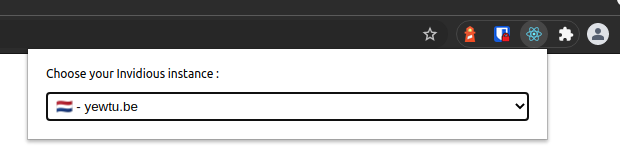
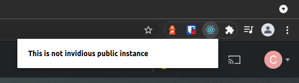

# Invidious Instance Switcher

Invidious Instance Switcher (IIS) is an browser extension wish you can change it on the fly. IIS work with Chrome and Firefox.

Extension bundled with CRA.

## How it work

TODO

## Installation

### Firefox

TODO

### Chrome

TODO

## Build

## TODO

- [ ] add favicon
- [ ] more sexy
- [ ] package and publish on Firefox and Chrome store
